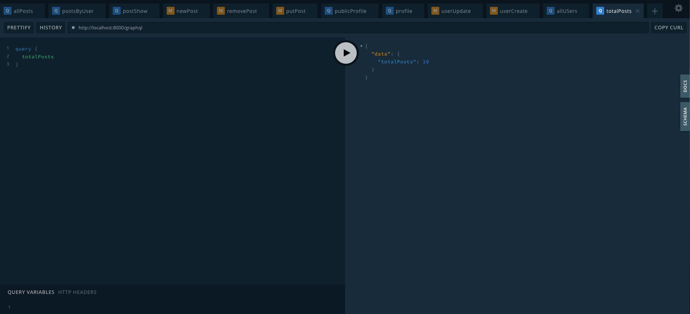

### graphql-server-node
Proyecto backend realizado para Escalab en su curso de `GraphQl`. Proyecto de administración de posts: `GET`, `POST`, `PUT`, `DELETE`.

Link demo proyecto: <a href="https://graphql-server-node-edgard.herokuapp.com/graphql">`https://graphql-server-node-edgard.herokuapp.com/graphql`</a>

### Variables de entorno: 

```
DATABASE: Link a la base de datos en MONGO DB
PORT: Puerto de conexión a la Base de Datos MONGO DB
CLOUDINARY_CLOUD_NAME: nombre cuenta Cloudinary
CLOUDINARY_API_KEY: apikey cuenta Cloudinary
CLOUDINARY_API_SECRET: secret cuenta Cloudinary
```

#### Firebase

Documentación de generación de información: <a href="https://firebase.google.com/docs/web/setup?hl=es-419">`https://firebase.google.com/docs/web/setup?hl=es-419`</a>


```
FIREBASE_PROJECT_ID: project_id
FIREBASE_PRIVATE_KEY_ID: private_key_id
FIREBASE_PRIVATE_KEY: private_key
FIREBASE_CLIENT_EMAIL: client_email
FIREBASE_CLIENT_ID: client_id
FIREBASE_AUTH_URI: auth_uri
FIREBASE_TOKEN_URI: token_uri
FIREBASE_AUTH_CERT_URL:  auth_provider_x509_cert_url
FIREBASE_CLIENT_CERT_URL: client_x509_cert_url
```


### Reestructuración node_modules
yarn or npm install

### Funcionalidades

#### `POSTS`
<details><summary><b>Total Post</b></summary>

  `Response`: Cantidad de post que se encuentren en la base de datos
    
</details>

<details><summary><b>All Posts</b></summary>

 
  `Response`: Todos los posts que estén en la base de datos
  
 `Params`:

    {
      "limit": Int!,
      "page": Int!,
      "search": String!
    }
    
</details>


<details><summary><b>Posts By User</b></summary>

 
  `Response`: Todos los posts que pertenezcan al usuario que realiza la consulta
  
 `Params`:

    {
      "limit": Int!,
      "page": Int!,
      "search": String!
    }
 
 `Headers`:
 
  ```
  {
    "authtoken": String!
  }
  ```
    
</details>

<details><summary><b>Show Post</b></summary>

 
  `Response`: Detalle del post a visualizar
  
 `Params`:

    {
      "id": ID!
    }
    
</details>


<details><summary><b>New Post</b></summary>

 
  `Response`: Post creado
  
 `Params`:
 
 ```
    "content": !String,
    "image": {
      "url": String!,
      "public_id": String!
    }
 ```
 
 `Headers`:
 
  ```
  {
    "authtoken": String!
  }
  ```
    
</details>


<details><summary><b>Post Update</b></summary>

 
  `Response`: Post Actualizado
  
 `Params`:
 
 ```
    "id": ID!
    "content": String!,
    "image": {
      "url": String!,
      "public_id": String!
    }
 ```
 
 `Headers`:
 
  ```
  {
    "authtoken": String!
  }
  ```
    
</details>


<details><summary><b>Post Delete</b></summary>

 
  `Response`: Post Eliminado
  
 `Params`:
 
  ```
     "id": ID!
  ```
 
 `Headers`:
 
  ```
  {
    "authtoken": String!
  }
  ```
    
</details>


#### `USERS`

<details><summary><b>All Users</b></summary>
 
  `Response`: Todos los usuarios en la base de datos
    
</details>


<details><summary><b>Public Profile</b></summary>

 
  `Response`: Información de un usuario
  
 `Params`:
 
  ```
     "id": ID!
  ```
 
 `Headers`:
 
  ```
  {
    "authtoken": String!
  }
  ```
    
</details>


<details><summary><b>Profile</b></summary>

 
  `Response`: Perfil del usuario logueado
 
 `Headers`:
 
  ```
  {
    "authtoken": String!
  }
  ```
    
</details>


<details><summary><b>Create User</b></summary>

 
  `Response`: Usuario ingresado a la base de datos
  
 `Params`:
 
 ```
    "email": String!,
    "username": String|!
 ```
 
 `Headers`:
 
  ```
  {
    "authtoken": String!
  }
  ```
    
</details>


<details><summary><b>Update User</b></summary>

 
  `Response`: Usuario actualizado a la base de datos (actualizar el mismo perfil del usuario ingresado a través del token)
  
 `Params`:
 
 ```
    "about": String!,
    "image": {
     "url": String!,
     "public_id": String!
   }
 ```
 
 `Headers`:
 
  ```
  {
    "authtoken": String!
  }
  ```
    
</details>


# Test Images in Graphql Playground

#### `Posts`

<p align="center">
  <span>Total Posts</span>
  
</p>

<p align="center">
  <span>All Posts</span>
  
</p>

<p align="center">
  <span>Posts By User</span>
  
</p>

<p align="center">
  <span>Show Post</span>
  
</p>

<p align="center">
  <span>Show Post - Not found</span>
  
</p>

<p align="center">
  <span>New Post</span>
  
</p>

<p align="center">
  <span>Post Update</span>
  
</p>


<p align="center">
  <span>Post Update - Not found</span>
  
</p>


<p align="center">
  <span>Post Delete</span>
  
</p>


<p align="center">
  <span>Post Delete- Not Found</span>
  
</p>


#### `Users`

<p align="center">
  <span>All Users</span>
  
</p>


<p align="center">
  <span>Public Profile</span>
  
</p>


<p align="center">
  <span>Profile</span>
  
</p>

<p align="center">
  <span>Create User</span>
  
</p>

<p align="center">
  <span>Update User</span>
  
</p>
